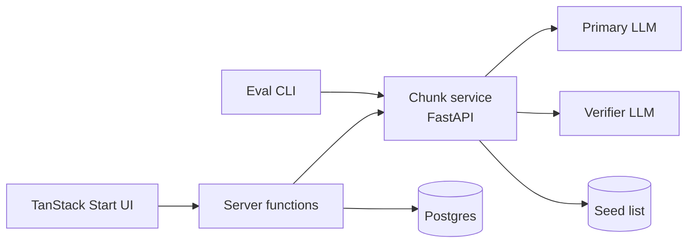
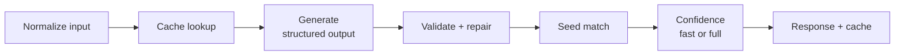

# Chunks Translator — Spec

Sep 23, 2026 · @Someone

## Overview

A web tool that turns an English phrase into reusable Spanish chunks, with regional variants and warnings about calques and other non-obvious translations. It is a learning and portfolio project, so the eval harness is a first-class deliverable, not an afterthought.

**Goals**

- Return 1–5 chunks per input, each a reusable pattern (e.g. **tener ganas de** + inf.), not a sentence translation.
- Give one conjugated example per chunk that closely mirrors the English input.
- List regional alternatives with a region tag and a derived confidence label.
- Warn about calques, false friends and other unintuitive differences.
- Measure quality with a repeatable eval suite.

**Non-goals (v1)**

- Input languages other than English; output other than Spanish.
- User accounts, auth, multi-user sharing.
- Built-in spaced repetition (export to Anki instead).

**Scope**

| Phase  | Features                                                                                               |
| ------ | ------------------------------------------------------------------------------------------------------ |
| MVP    | Input field, chunk list, conjugated examples, regional alternatives, notes dropdown, copy to clipboard |
| Saving | Postgres storage of saved chunks, CSV and TXT export (Anki-ready CSV)                                  |
| Evals  | Seed set, self-consistency, cross-model agreement, CLI report                                          |

## Architecture

Three pieces: a TanStack Start web app, a Python FastAPI chunk service, and one Postgres database. The web app never calls an LLM directly; it talks to the chunk service through server functions, so API keys stay server-side.



The eval CLI calls the same service endpoint as the UI, so evals test exactly what users get.

| Component     | Choice                                                                      | Why                                                                                                       |
| ------------- | --------------------------------------------------------------------------- | --------------------------------------------------------------------------------------------------------- |
| Web           | TanStack Start, TanStack Query, Tailwind                                    | Your stated choice; server functions proxy the chunk service                                              |
| Chunk service | Python 3.12, FastAPI, Pydantic v2                                           | Pydantic schemas double as LLM structured-output schemas; Python is the natural home for the eval harness |
| LLM access    | Provider SDKs behind a small `LLMClient` interface                          | Swap primary and verifier models per eval run                                                             |
| Database      | Postgres, accessed from the web app via Drizzle                             | Saving is a web-app concern; the chunk service stays stateless                                            |
| Cache         | Postgres table keyed by hash(input, prompt\_version, model)                 | Cheap repeat lookups; makes self-consistency runs affordable in dev                                       |
| Deploy        | Docker Compose locally; e.g. Fly.io or Railway for web + service + Postgres | One `docker compose up` for demos                                                                         |

**Repo layout (monorepo)**

- `apps/web` — TanStack Start app
- `services/chunker` — FastAPI app, prompts, confidence logic
- `evals/` — seed set (YAML), runner, reports
- `packages/schema` — JSON Schema exported from Pydantic, used to generate TS types for the web app

## API contract

One main endpoint, `POST /v1/chunk`, returns chunks with examples, alternatives and notes. The same Pydantic models define the LLM's structured output and the HTTP response.

**Request**

```json
{
  "text": "I'm really looking forward to seeing you",
  "source_lang": "en",
  "target_lang": "es",
  "preferred_region": "ES",
  "include_alternatives": true,
  "confidence_mode": "fast"
}
```

- `preferred_region`: `neutral` | `ES` | `MX` | `AR` | `CO` | `CL` | `CARIB` | `US`. The primary chunk uses this region; others become alternatives.
- `confidence_mode`: `fast` (seed lookup only) or `full` (seed + self-consistency + verifier). The UI uses `fast` by default and upgrades in the background.
- Limits: 1–200 characters; one phrase or sentence.

**Response**

```json
{
  "request_id": "req_01J...",
  "input": "I'm really excited to go to the beach this weekend.",
  "translation": "Tengo muchas ganas de ir a la playa este fin de semana.",
  "chunks": [
    {
      "id": "ch_1",
      "pattern": "tener (muchas) ganas de",
      "slots": ["+ inf."],
      "surface": "tener muchas ganas de",
      "gloss_en": "to be really looking forward to (doing something)",
      "register": "neutral",
      "regions": ["neutral"],
      "example": {
        "es": "Tengo muchas ganas de ir a la playa este fin de semana.",
        "en": "I'm really excited to go to the beach this weekend.",
        "highlight": [0, 21],
        "conjugation": { "verb": "tener", "person": "1sg", "tense": "presente" }
      },
      "confidence": {
        "label": "high",
        "signals": { "seed": true, "consistency": 1.0, "verifier": "agree" }
      },
      "alternatives": [
        {
          "surface": "me hace mucha ilusión + inf.",
          "example_es": "Me hace mucha ilusión ir a la playa este fin de semana.",
          "regions": ["ES"],
          "register": "neutral",
          "confidence": { "label": "high", "signals": { "seed": true } }
        },
        {
          "surface": "estar re manija por + inf.",
          "example_es": "Estoy re manija por ir a la playa este finde.",
          "regions": ["AR"],
          "register": "coloquial",
          "confidence": {
            "label": "low",
            "signals": { "consistency": 0.4, "verifier": "unsure" }
          }
        }
      ]
    }
  ],
  "notes": [
    {
      "kind": "false_friend",
      "avoid": "Estoy muy excitado",
      "why": "'Excitado' usually reads as sexually aroused. Say emocionado/a, or use tener ganas de.",
      "applies_to": ["ch_1"]
    },
    {
      "kind": "register",
      "avoid": "el weekend",
      "why": "Common in US Spanish but reads as Spanglish elsewhere. 'Finde' is informal, mainly Spain and Río de la Plata.",
      "applies_to": ["ch_3"]
    }
  ],
  "meta": {
    "prompt_version": "p3",
    "model": "primary-model-id",
    "latency_ms": 1840,
    "cached": false
  }
}
```

**Field notes**

- `translation`: one natural full-sentence translation in the preferred region. The chunks must appear in it, so the UI can underline them.
- `slots`: the placeholders shown as pills (`+ inf.`, `+ lugar`, `+ subj.`), kept separate from `pattern`.
- `example.highlight`: character range of the chunk inside `example.es`, computed by the service after generation (not by the model).
- `register` and `confidence` are separate fields and are rendered separately.
- `regions`: use `neutral` when a form is used across most of the Spanish-speaking world; only tag a country when it is characteristic there.
- `notes[].applies_to`: the chunk ids the note relates to. The UI uses it to link a trap to a card, not to mark the chunk as risky.

**Note kinds** (the dropdown is broader than calques): `calque`, `false_friend`, `preposition` (e.g. destination takes _a_, but means of transport takes _en_: _ir en tren_), `ser_estar`, `subjunctive_trigger`, `gender_or_article`, `register`, `other`.

**Other endpoints**

- `GET /v1/health` — liveness.
- `GET /v1/meta` — supported regions, note kinds, current prompt version.
- Errors: `422` invalid input, `502` LLM failure after retries, `503` when rate-limited upstream. Body: `{ "error": { "code", "message" } }`.

## Generation pipeline

One structured LLM call produces the draft; cheap deterministic steps then validate it and attach confidence. Keep each step a pure function so evals can test them separately.



1. **Normalize** — trim, collapse whitespace, cap length, detect empty or non-English input.
2. **Cache lookup** — key = sha256(normalized text, preferred\_region, prompt\_version, model).
3. **Generate** — one call with the Pydantic model as the JSON schema (tool use or native structured output, depending on provider). Temperature 0.3 for the user-facing call.
4. **Validate and repair** — schema check; drop chunks whose example doesn't contain the chunk's lemma; drop region tags outside the allowed enum; one retry with the validation errors appended if the output fails.
5. **Seed match** — normalize each chunk (lowercase, strip accents for matching only, lemmatize the verb) and look it up in the seed list.
6. **Confidence** — see the next section.

**Prompt design**

- System prompt defines a chunk: a multi-word unit a native speaker would store as one piece (collocation, verb + preposition frame, fixed expression). Explicitly not word-by-word translation.
- Instruct the model to first write the literal English-speaker attempt privately, then use it to fill `notes` — this is what surfaces calques.
- The example must reuse the input's person, tense and content where possible, so it "closely matches the English".
- Regions: only tag a region when the chunk is characteristic there; default to `neutral`. Say explicitly that inventing a regionalism is worse than omitting one.
- 4–6 few-shot examples from the seed set, covering one simple, one high-variance and one advanced case. Exclude few-shot items from the eval split.
- Version prompts as files (`prompts/p3.md`) and log `prompt_version` in every response and eval run.

**Validation checks worth coding**

- Example sentence is Spanish and contains the chunk (lemma-level match, using spaCy `es_core_news_sm`).
- `avoid` text in a calque note is not identical to any returned chunk.
- No duplicate chunks after normalization.
- 1 ≤ chunks ≤ 5; ≤ 4 alternatives per chunk.
- Every chunk's surface (lemma-level) appears in `translation`; otherwise regenerate the translation or drop the chunk.

## Confidence scoring

Confidence is derived from signals, never asked of the model. It is scored per chunk and per region tag, because a chunk can be right while its region tag is wrong.

**Signals**

| Signal        | How it's computed                                                                       | Cost           | Mode       |
| ------------- | --------------------------------------------------------------------------------------- | -------------- | ---------- |
| Seed          | Normalized chunk + region found in the seed list                                        | \~0            | fast, full |
| Consistency   | Share of N=5 samples (temperature 0.8) that contain the chunk; same for each region tag | 5 LLM calls    | full       |
| Verifier      | A second model answers a yes/no check per chunk and per region tag                      | 1 batched call | full       |
| User feedback | Thumbs up/down on saved chunks (later)                                                  | 0              | both       |

**Rules** (evaluated top to bottom, first match wins)

1. Seed match on chunk and region → `high`, badge "verified".
2. Consistency ≥ 0.8 and verifier agrees → `high`.
3. Consistency ≥ 0.6, or verifier agrees → `med`.
4. Otherwise → `low`.
5. In `fast` mode without a seed match → `unrated`, shown neutrally until the `full` result arrives.

**Verifier prompt shape**: "Is _estar deseando_ + infinitive commonly used in Spain to mean 'to look forward to'? Answer yes, no or unsure, then one line of reasoning." Ask per claim, not "rate this output"; narrow questions get more reliable answers.

**Matching samples**: compare chunks after normalization (lemma of the head verb, lowercase, optional words in parentheses removed). Log unmatched near-misses so you can tune the matcher.

Thresholds are starting guesses. Tune them with the eval suite: pick the ones that maximize precision of `high` on the seed set.

## Frontend

The trozo mockup below is the reference for the translator view: the full translation first, then the traps, then the chunk cards. Desktop shows three cards per row; mobile stacks them.

&#91;image: trozo translator mockup\]

**Routes**

- `/` — translator. Query string `?q=…&region=ES` so results are shareable and back-button friendly.
- `/saved` — saved chunks, filter by region and tag, export buttons. The header shows "Saved · n" and "Export to Anki".

**Translator view, top to bottom**

1. **Input bar**: one-line input that grows to a textarea, 200-char counter, "Chunk it" button, submit on Enter (Shift+Enter for a newline). A region selector sits in the bar (neutral, ES, MX, AR, CO); default comes from a cookie.
2. **Full translation**: the `translation` field in italics under the input, with a copy button on hover.
3. **Watch out box**: "Watch out · n traps". Each trap shows the phrase to avoid struck through, a kind label (False friend, Register, Calque…) and a one-line reason. No trap numbering of its own; instead a small "→ card 01" link that scrolls to and highlights the card it relates to (from `applies_to`).
4. **Chunk cards**: card number, the pattern in bold serif, slot pills (`+ inf.`, `+ lugar`), gloss, and the example sentence with the chunk underlined.

**Card details**

- **Trap link, not a warning on the chunk**: when a note points at a card, the card shows "avoids: el weekend" in muted text. It never shows a ⚠ badge, because the chunk itself is the safe choice.
- **Register pill** next to the pattern (coloquial / neutral / formal), and a separate **confidence** element (dot + text label). Never combine them in one slot like "low · slang".
- **Regional variants**: collapsed as "+ n regional variants". Expanded rows show a region pill, the variant, a register pill if not neutral, and confidence. Variants used everywhere get a `neutral` pill, not a country. `low` rows are greyed with a "check this" tooltip; `unrated` rows show a small spinner until full confidence arrives.
- **Actions**: Copy is a split button (chunk only / chunk + example; the main click copies the chunk). Save turns into "Saved ✓" and increments the header count.

**States**

- Loading: skeleton for the translation line and three cards.
- Fast result first; confidence dots start as `unrated` and update in place when the `full` call resolves.
- No chunks found (e.g. a single proper noun): show the translation only, with a short "Nothing worth chunking here" line.
- Error: inline message under the input with Retry.

**Data flow**

- `createServerFn` `chunk({ text, region })` calls the chunk service with a service token; TanStack Query caches by `[text, region]`.
- A second server function fetches `confidence_mode: full` and patches the query cache.
- Clipboard via `navigator.clipboard.writeText`, with a toast on success.

**Accessibility**: keyboard reachable actions, `aria-live` region for results, confidence always has a text label, struck-through traps also carry "Avoid:" as screen-reader text.

## Saving and export

Saved chunks live in Postgres, owned by the web app; with no auth in v1, a single-owner app is fine (add a `user_id` column now so auth is a small change later).

**Schema**

```sql
create table saved_chunks (
  id            uuid primary key default gen_random_uuid(),
  user_id       uuid null,
  source_text   text not null,
  pattern       text not null,
  surface       text not null,
  gloss_en      text,
  example_es    text not null,
  example_en    text,
  register      text check (register in ('coloquial','neutral','formal')),
  regions       text[] not null default '{neutral}',
  confidence    text check (confidence in ('high','med','low','unrated')),
  notes         jsonb not null default '[]',
  tags          text[] not null default '{}',
  feedback      smallint check (feedback in (-1, 0, 1)) default 0,
  prompt_version text,
  created_at    timestamptz not null default now(),
  unique (user_id, surface, example_es)
);

create table chunk_cache (
  key           text primary key,
  response      jsonb not null,
  created_at    timestamptz not null default now()
);
```

**Export formats**

- **CSV (Anki-ready)**: columns `Front`, `Back`, `Tags`. Front = English example; Back = Spanish example with the chunk in `<b>`, plus pattern and region. Offer a cloze variant: `Tengo {{c1::muchas ganas de}} verte.`
- **TXT**: one chunk per line, `pattern — example_es — regions`.
- Streamed from a server route (`/api/export?format=csv&region=ES`), UTF-8 with BOM so Excel opens accents correctly.

**Copy to clipboard**: two options per card, chunk only or chunk + example. Plus "Copy all" on the result, formatted as the TXT line format.

## Evals

The eval suite answers four questions per prompt/model version: does it find the right chunks, does it avoid calques, are region tags correct, and does the confidence label mean anything. Target \~120 seed items for v1.

**Seed set composition**

| Tier                   | Share | What it tests                                     | Examples                                                                                                                   |
| ---------------------- | ----- | ------------------------------------------------- | -------------------------------------------------------------------------------------------------------------------------- |
| Simple                 | 30%   | Common collocations, basic frames                 | "I miss you" → echar de menos / extrañar; "I'm hungry" → tener hambre                                                      |
| High regional variance | 30%   | Region tags, alternatives                         | popcorn (palomitas / pochoclo / cotufas / crispetas / canguil), bus, car, to drive, cool/awesome                           |
| Advanced               | 25%   | Idioms, subjunctive triggers, ser/estar, register | "It's up to you", "I'm about to leave", "as far as I'm concerned"                                                          |
| Calque traps           | 15%   | Known English-speaker errors                      | "apply for a job", "realize", "make a decision", "have a good time", "I'm excited" (excitado), "this weekend" (el weekend) |

**Seed item format (YAML)**

```yaml
- id: popcorn-01
  tier: regional
  input: "Let's get some popcorn"
  expected_chunks:
    - surface: palomitas
      regions: [ES, MX]
    - surface: pochoclo
      regions: [AR]
    - surface: cotufas
      regions: [VE]
  forbidden:
    - 'maíz explotado'
  expected_note_kinds: []
  source: 'your note / RAE / DLE / native check'
```

Tag each item with a source. Getting 20–30 regional items checked by native speakers (language-exchange partners, r/Spanish) is worth more than doubling the set.

**Metrics**

| Metric               | Definition                                                                      |
| -------------------- | ------------------------------------------------------------------------------- |
| Chunk recall         | Share of `expected_chunks` found (normalized match)                             |
| Calque rate          | Share of items where output contains a `forbidden` phrase as a chunk or example |
| Note recall          | Share of `expected_note_kinds` present in `notes`                               |
| Region precision     | Correct region tags / all region tags on matched chunks                         |
| High-label precision | Share of chunks labelled `high` that are correct — the key confidence metric    |
| Calibration gap      | Accuracy of high vs med vs low buckets; should be strictly decreasing           |
| Schema pass rate     | Outputs valid on first try (before repair)                                      |
| Latency / cost       | p50 and p95 latency, tokens per request                                         |

**Self-consistency eval**

- Run each seed item N=5 times at temperature 0.8.
- Report per-item chunk agreement (Jaccard over normalized chunk sets) and region-tag agreement.
- Check the core assumption: are high-agreement chunks actually more often correct? Plot accuracy by agreement bucket.

**Cross-model agreement eval**

- Generate with model A, verify with model B, and swap roles.
- Report verifier agreement rate and, on seed items, verifier accuracy (does B say "no" to known-wrong region tags?).
- Include 10–15 deliberately wrong "poison" claims (e.g. _pochoclo_ tagged ES) to measure whether the verifier catches errors or just agrees.

**Over-tagging check**: the mockup's first draft tagged _me emociona mucho_ as MX and _estoy emocionado/a por_ as CO, although both are used everywhere. Add such pan-Hispanic forms to the seed set with `regions: [neutral]`, and report an over-tagging rate (country tag on a form expected to be neutral) next to region precision.

**LLM-as-judge (optional, later)**

For open-ended quality ("is this example natural?"), a judge prompt with a 1–3 rubric. Spot-check 20 judgements by hand before trusting it.

**Harness**

- `evals/run.py --prompt p3 --model primary --verifier secondary --split test` calls the running service over HTTP.
- Splits: `dev` (tune prompts) and `test` (report only); few-shot examples come from `dev`.
- Output: JSONL of raw results plus a Markdown report comparing to the previous run (metric deltas, newly failing items).
- Cache LLM responses by hash so re-scoring is free; set a cost cap per run.
- Run on every prompt change; a GitHub Action on PRs touching `prompts/` or `services/` makes a nice portfolio detail.

## Milestones and open questions

Build the evals alongside the service, not after it: the first 30 seed items come before the first UI.

| #   | Milestone               | Done when                                                                                           |
| --- | ----------------------- | --------------------------------------------------------------------------------------------------- |
| 1   | Seed v0 + chunk service | 30 seed items; `POST /v1/chunk` returns valid JSON; eval runner prints chunk recall and calque rate |
| 2   | Translator UI           | Input, chunk cards, notes dropdown, copy; `fast` confidence from seed                               |
| 3   | Full confidence         | Self-consistency + verifier wired; thresholds tuned on `dev`                                        |
| 4   | Saving + export         | Postgres, Saved route, Anki CSV and TXT export                                                      |
| 5   | Seed to 120 + report    | Native-checked regional items; README with metrics table and one before/after prompt comparison     |

**Open questions**

- [ ] Which two models for primary and verifier (ideally different providers, so errors are less correlated)?
- [ ] Which regions to support at launch? Suggest ES, MX, AR, CO + neutral, then expand.
- [ ] Does the example sentence always mirror the input's person and tense, or show the most common form when the input is a bare fragment ("to look forward to")?
- [ ] Should notes include a short grammar hint (e.g. "triggers subjunctive") or stay strictly about pitfalls?
