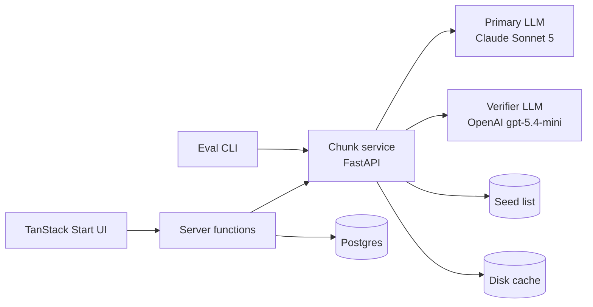

# Architecture

<!-- status: draft | approved -->

| Field   | Value      |
| ------- | ---------- |
| status  | approved   |
| created | 2026-09-23 |
| revised | 2026-09-25 |

## System Overview <!-- required -->

Three pieces: a TanStack Start web app, a Python FastAPI chunk service, and one Postgres database. The web app never calls an LLM directly — it talks to the chunk service through server functions (with an optional service token), so API keys stay server-side. The chunk service keeps its own disk response cache and holds no user data; the web app owns Postgres (saved chunks, from 004). The eval CLI calls the same `POST /v1/chunk` endpoint as the UI, so evals test exactly what users get.

## Component Map <!-- required -->

- **`apps/web`** — Translator route `/` (query string `?q=…&region=…` for shareable results; last region remembered in a cookie), `/saved` route with filters and export buttons (004), server functions (`chunkFn` fast call, `chunkFullFn` background full-confidence call, save in 004), streamed export route (`/api/export?format=csv|txt`, 004), Drizzle schema for `saved_chunks` (004).
- **`services/chunker`** — `POST /v1/chunk`, `GET /v1/health`, `GET /v1/meta`. Generation pipeline as pure functions: normalize → cache lookup → structured LLM generate → validate/repair → seed match → fast confidence; full mode rescoring (`app/pipeline/full.py`): samples → consistency → verifier → labels. Versioned prompt files (`prompts/pN.md`). Dev scripts: `export_schema.py`, `poison.py`, `spike_full.py`.
- **`evals/`** — YAML seed set (30 items today, ~120 target, four tiers: simple, high regional variance, advanced, calque traps) and poison claims for the verifier; runner (`run.py --prompt --split --confidence fast|full --verifier`), threshold sweep (`tune.py`); JSONL raw results, summary JSON and a Markdown report with metric deltas per run.
- **`packages/schema`** — JSON Schema exported from the Pydantic models; generates TS types so the API contract has one source of truth.

## Data Flow <!-- required -->

1. User submits a phrase (1–200 chars) with a preferred region → `chunkFn` calls the chunk service with `confidence_mode: fast`.
2. Service normalizes input, checks the disk cache (key = sha256(normalized text, region, prompt_version, model)), makes one structured-output call to the primary model (no sampling parameters; depth set by `effort`), validates and repairs (lemma-level checks via spaCy `es_core_news_sm`, one retry when repair leaves no chunks), matches against the seed list, and attaches fast confidence.
3. Fast result renders immediately: seed-matched chunks are `high` ("verified"), the rest `unrated` with a spinner. `chunkFullFn` then requests `confidence_mode: full`, which rescores the same fast response (chunk ids and text never change): 5 further samples from the primary and one batched verifier call run concurrently. The result is written into the fast query's cache entry, so labels settle in place and back/forward stay instant.
4. Save writes the chunk to `saved_chunks`; export streams Anki-ready CSV (UTF-8 with BOM) or TXT from a server route (004).

Confidence is derived from signals (seed match, consistency share, verifier agreement), never asked of the model. It is scored per chunk and per alternative; per-region-tag confidence is not implemented. Rules, first match wins:

1. Seed match on chunk and region → `high` ("verified").
2. Consistency ≥ T_high and verifier agrees → `high`.
3. Consistency ≥ T_med, or verifier agrees → `med`.
4. Some signal present → `low`.
5. No signal (fast mode without a seed match, or full mode with every signal missing) → `unrated`.

Thresholds are tuned on the dev split: **T_high = 1.0** (with 5 samples, all must agree) and **T_med = 0.6** (003).

Signals are durable; labels and the seed signal are recomputed whenever a cached response is served, so re-tuning thresholds or growing the seed needs no cache eviction.

## External Dependencies <!-- required -->

- **Primary LLM:** Anthropic Claude Sonnet 5 (`claude-sonnet-5`) for generation and self-consistency samples, via `messages.parse` structured output. It rejects temperature/top-p/top-k, so there is no sampling-temperature lever; self-consistency uses default sampling.
- **Verifier LLM:** OpenAI `gpt-5.4-mini`, a different vendor so errors are less correlated; answers yes/no/unsure per claim via structured output. Optional: without `OPENAI_API_KEY`, full mode uses consistency only.
- Postgres (saved chunks, from 004).
- spaCy with `es_core_news_sm` for lemma-level validation, seed matching and consistency matching.
- Docker Compose for the one-command stack; `uvx honcho` + `Procfile` for local development; Fly.io/Railway-style host for deploy.

## Key Constraints <!-- required -->

- LLM API keys never reach the client; the browser only ever talks to server functions.
- Confidence is always derived from signals — the model is never asked to rate itself.
- Every pipeline step is a pure function so evals can test steps in isolation.
- Prompts are versioned files; `prompt_version` is logged in every response and eval run. Editing a prompt in place does not invalidate the cache: bump the version.
- The disk response cache is keyed by hash(input, region, prompt_version, model); full-mode entries add samples, verifier model and the perturbation flag. It makes eval re-runs and re-scoring free. Contract fields added later must be optional, or backfilled on read, because cached responses are served as stored.
- The full-sentence `translation` must contain every chunk's surface (lemma-level); the service returns `translation_highlight` ranges so the UI can underline them.
- Regions are `neutral`, ES, MX, AR, CO; `neutral` is the default and a country tag is applied only when a form is characteristic there (over-tagging is to be measured in 005).
- Full mode costs about six LLM calls per new phrase (five primary, one verifier); there is no cost cap.

## Open Decisions <!-- optional -->

- Example mirroring policy for bare-fragment inputs ("to look forward to"): deferred to prompt iteration since 001.
- Thresholds were tuned on 20 dev chunks and 30 alternatives; re-tune on the 120-item seed in 005.
- The seed format has one answer per expected chunk, which understates precision for valid alternatives; 005 should add accepted variants.

Resolved: primary and verifier models (001, 003); launch region set ES, MX, AR, CO + neutral (001); confidence thresholds (003).

## Revision History

| Date       | Change                                                                                                                                                                        |
| ---------- | ----------------------------------------------------------------------------------------------------------------------------------------------------------------------------- |
| 2026-09-23 | Initial architecture                                                                                                                                                          |
| 2026-09-25 | Post-003 refresh: models and no-temperature constraint, disk cache in the chunker, full-mode design and tuned thresholds, `unrated` rule, relabel-on-read, resolved decisions |
