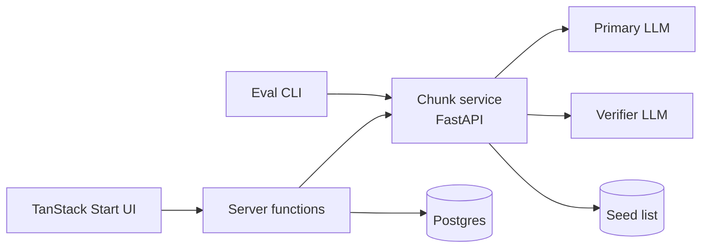

# Architecture

<!-- status: draft | approved -->

| Field   | Value      |
| ------- | ---------- |
| status  | approved   |
| created | 2026-09-23 |

## System Overview <!-- required -->

Three pieces: a TanStack Start web app, a Python FastAPI chunk service, and one Postgres database. The web app never calls an LLM directly — it talks to the chunk service through server functions (with a service token), so API keys stay server-side. The web app owns Postgres (saved chunks and the response cache); the chunk service stays stateless. The eval CLI calls the same `POST /v1/chunk` endpoint as the UI, so evals test exactly what users get.

## Component Map <!-- required -->

- **`apps/web`** — Translator route `/` (query string `?q=…&region=…` for shareable results), `/saved` route with filters and export buttons, server functions (`chunk` fast call, background `full` confidence call, save), streamed export route (`/api/export?format=csv|txt`), Drizzle schema for `saved_chunks` and `chunk_cache`.
- **`services/chunker`** — `POST /v1/chunk`, `GET /v1/health`, `GET /v1/meta`. Generation pipeline as pure functions: normalize → cache lookup → structured LLM generate → validate/repair → seed match → confidence scoring. Versioned prompt files (`prompts/pN.md`).
- **`evals/`** — YAML seed set (~120 items across four tiers: simple, high regional variance, advanced, calque traps), runner (`run.py --prompt --model --verifier --split`), JSONL raw results + Markdown report with metric deltas.
- **`packages/schema`** — JSON Schema exported from the Pydantic models; generates TS types so the API contract has one source of truth.

## Data Flow <!-- required -->

1. User submits a phrase (1–200 chars) with a preferred region → server function calls the chunk service with `confidence_mode: fast`.
2. Service normalizes input, checks the cache (key = sha256(normalized text, region, prompt_version, model)), makes one structured-output LLM call, validates and repairs (lemma-level checks via spaCy `es_core_news_sm`), matches against the seed list, and attaches derived confidence.
3. Fast result renders immediately (seed-only confidence; unmatched chunks show `unrated`). A second server function requests `confidence_mode: full` (self-consistency N=5 at temp 0.8 + one batched verifier call) and patches the TanStack Query cache in place.
4. Save writes the chunk to `saved_chunks`; export streams Anki-ready CSV (UTF-8 with BOM) or TXT from a server route.

Confidence is derived from signals (seed match, consistency share, verifier agreement), never asked of the model, and is scored per chunk **and** per region tag. Rules, first match wins: seed match → `high` ("verified"); consistency ≥ 0.8 + verifier agrees → `high`; consistency ≥ 0.6 or verifier agrees → `med`; else `low`; fast-mode without seed → `unrated`.

## External Dependencies <!-- required -->

- Two LLM providers — primary (generation, temp 0.3) and verifier (yes/no/unsure checks per claim), ideally different vendors so errors are less correlated. Model choice is an open decision.
- Postgres (saved chunks + response cache).
- spaCy with `es_core_news_sm` for lemma-level validation and seed matching.
- Docker Compose locally; Fly.io/Railway-style host for deploy.

## Key Constraints <!-- required -->

- LLM API keys never reach the client; the browser only ever talks to server functions.
- Confidence is always derived from signals — the model is never asked to rate itself.
- Every pipeline step is a pure function so evals can test steps in isolation.
- Prompts are versioned files; `prompt_version` is logged in every response and eval run.
- Response cache keyed by hash(input, region, prompt_version, model) makes self-consistency runs affordable in dev and re-scoring free.
- The full-sentence `translation` must contain every chunk's surface (lemma-level) so the UI can underline them.
- Regions default to `neutral`; a country tag is applied only when a form is characteristic there (over-tagging is measured by the eval suite).

## Open Decisions <!-- optional -->

- Primary and verifier model choice (resolve in feature spec for milestone 1).
- Launch region set — proposed ES, MX, AR, CO + neutral.
- Confidence thresholds (0.8 / 0.6) are starting guesses to be tuned against the seed set for `high`-label precision.
- Example mirroring policy for bare-fragment inputs.
