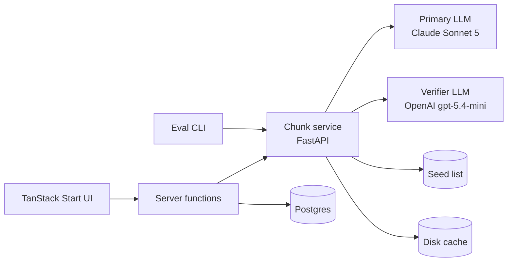

# Architecture

<!-- status: draft | approved -->

| Field   | Value      |
| ------- | ---------- |
| status  | approved   |
| created | 2026-09-23 |
| revised | 2026-09-29 |

## System Overview <!-- required -->

Three pieces: a TanStack Start web app, a Python FastAPI chunk service, and one Postgres database. The web app never calls an LLM directly — it talks to the chunk service through server functions (with an optional service token), so API keys stay server-side. The chunk service keeps its own disk response cache and holds no user data; the web app owns Postgres (saved chunks, from 004). The eval CLI calls the same `POST /v1/chunk` endpoint as the UI, so evals test exactly what users get.

**Production topology (planned, roadmap 006–009).** Locally everything runs in Docker Compose. In production:

- Both services run on **Fly.io** from their existing Docker images, as two Fly apps in the same organization and region.
- The web app is the only public entry point. The custom domain is on **Cloudflare** (DNS proxied to Fly) behind **Cloudflare Access**, and the web app rejects any request without a valid Access JWT (`Cf-Access-Jwt-Assertion`), so the app's `*.fly.dev` hostname can't bypass Access.
- The chunk service has no public IP. The web app reaches it over Fly's private network (Flycast, `http://trozo-chunker.flycast`) with `CHUNKER_TOKEN`; on Fly the chunk endpoint refuses to serve (503) without the token set. Deployed in 007: one shared-cpu-1x 512 MB machine in `fra` that suspends when idle and resumes on the next Flycast request (about 0.9 s; about 11 s from a stopped machine).
- Postgres is **Neon** (a production branch, with a branch per preview). Drizzle keeps node-postgres everywhere; production uses Neon's pooled connection string.
- The response cache stays on disk, on a Fly volume attached to the chunker.
- Migrations run as the web app's Fly `release_command`, before the new version takes traffic.
- The eval CLI keeps running against a local chunker.

```mermaid
flowchart LR
  UI[TanStack Start UI] --> SF[Server functions]
  SF --> API[Chunk service<br/>FastAPI]
  API --> LLM1[Primary LLM<br/>Claude Sonnet 5]
  API --> LLM2[Verifier LLM<br/>OpenAI gpt-5.4-mini]
  API --> SEED[(Seed list)]
  API --> CACHE[(Disk cache)]
  SF --> DB[(Postgres)]
  EV[Eval CLI] --> API
```

## Component Map <!-- required -->

- **`apps/web`** — Translator route `/` (query string `?q=…&region=…` for shareable results; last region remembered in a cookie), `/saved` route with filters and export buttons (004), server functions (`chunkFn` fast call, `chunkFullFn` background full-confidence call; saved chunks: `saveChunkFn`, `savedIndexFn`, `listSavedFn`, `deleteSavedFn`, `syncConfidenceFn`), streamed export route (`/api/export?format=csv|cloze|txt`), Drizzle schema and committed migrations for `saved_chunks`, applied by `migrate.mjs` (drizzle-orm's migrator bundled into the runtime image; the `migrate` Compose service and, in production, Fly's `release_command`). Global request middleware (`src/start.ts`) checks the Cloudflare Access JWT on every server request when Access is configured and fails closed on Fly without it; `/healthz` is exempt (006).
- **`services/chunker`** — `POST /v1/chunk`, `GET /v1/health`, `GET /v1/meta` (includes `seed_entries`; the image bakes in the seed, 006). Generation pipeline as pure functions: normalize → cache lookup → structured LLM generate → validate/repair → seed match → fast confidence; full mode rescoring (`app/pipeline/full.py`): samples → consistency → verifier → labels. Versioned prompt files (`prompts/pN.md`). Dev scripts: `export_schema.py`, `poison.py`, `spike_full.py`.
- **`evals/`** — YAML seed set (`seed_v1.yaml`, 120 items, four tiers: simple, high regional variance, advanced, calque traps; `accepted:` and `also_valid:` answers and a `checked:` field per item, 005) and poison claims for the verifier; runner (`run.py --prompt --split --confidence fast|full --verifier`), offline re-scoring (`rescore.py`), threshold sweep (`tune.py`); metrics include region precision and over-tagging; JSONL raw results, summary JSON and a Markdown report with metric deltas per run; reports behind published numbers in `evals/reports/`.
- **`packages/schema`** — JSON Schema exported from the Pydantic models; generates TS types so the API contract has one source of truth.

## Data Flow <!-- required -->

1. User submits a phrase (1–200 chars) with a preferred region → `chunkFn` calls the chunk service with `confidence_mode: fast`.
2. Service normalizes input, checks the disk cache (key = sha256(normalized text, region, prompt_version, model)), makes one structured-output call to the primary model (no sampling parameters; depth set by `effort`), validates and repairs (lemma-level checks via spaCy `es_core_news_sm`, one retry when repair leaves no chunks), matches against the seed list, and attaches fast confidence.
3. Fast result renders immediately: seed-matched chunks are `high` ("verified"), the rest `unrated` with a spinner. `chunkFullFn` then requests `confidence_mode: full`, which rescores the same fast response (chunk ids and text never change): 5 further samples from the primary and one batched verifier call run concurrently. The result is written into the fast query's cache entry, so labels settle in place and back/forward stay instant.
4. Save writes the chunk (or one regional variant) to `saved_chunks`, deduplicated on surface + Spanish example. If full confidence settles after the save, the saved `unrated` label is updated to the settled one (only ever `unrated` → settled). Export streams Anki Basic or Cloze CSV (UTF-8 BOM, then Anki `#` file headers) or TXT from a server route, paging rows from Postgres.

Confidence is derived from signals (seed match, consistency share, verifier agreement), never asked of the model. It is scored per chunk and per alternative; per-region-tag confidence is not implemented. Rules, first match wins:

1. Seed match on chunk and region → `high` ("verified").
2. Consistency ≥ T_high and verifier agrees → `high`.
3. Consistency ≥ T_med, or verifier agrees → `med`.
4. Some signal present → `low`.
5. No signal (fast mode without a seed match, or full mode with every signal missing) → `unrated`.

Thresholds are tuned on the dev split: **T_high = 1.0** (with 5 samples, all must agree) and **T_med = 0.6** (003; re-checked and kept on the 120-item seed in 005).

Signals are durable; labels and the seed signal are recomputed whenever a cached response is served, so re-tuning thresholds or growing the seed needs no cache eviction.

## External Dependencies <!-- required -->

- **Primary LLM:** Anthropic Claude Sonnet 5 (`claude-sonnet-5`) for generation and self-consistency samples, via `messages.parse` structured output. It rejects temperature/top-p/top-k, so there is no sampling-temperature lever; self-consistency uses default sampling.
- **Verifier LLM:** OpenAI `gpt-5.4-mini`, a different vendor so errors are less correlated; answers yes/no/unsure per claim via structured output. Optional: without `OPENAI_API_KEY`, full mode uses consistency only.
- Postgres 15+ (saved chunks; the unique key uses `NULLS NOT DISTINCT`): Docker `postgres:16` locally, **Neon** in production (planned).
- spaCy with `es_core_news_sm` for lemma-level validation, seed matching and consistency matching.
- Docker Compose for the one-command stack; `uvx honcho` + `Procfile` for local development.
- **Fly.io** for production (planned, 006–009): both services as Fly apps, private networking between them, a volume for the chunker's response cache, and per-PR preview apps.
- **Cloudflare** for DNS/TLS on the custom domain and Access (authentication in front of the site); it does not host code.

## Key Constraints <!-- required -->

- LLM API keys never reach the client; the browser only ever talks to server functions.
- Confidence is always derived from signals — the model is never asked to rate itself.
- Every pipeline step is a pure function so evals can test steps in isolation.
- Prompts are versioned files; `prompt_version` is logged in every response and eval run. Editing a prompt in place does not invalidate the cache: bump the version.
- The disk response cache is keyed by hash(input, region, prompt_version, model, matcher version); full-mode entries add samples, verifier model and the perturbation flag. Bump `MATCHER_VERSION` when validation or matching changes (bug 003); chunks validation drops are listed in `meta.dropped`. It makes eval re-runs and re-scoring free. Contract fields added later must be optional, or backfilled on read, because cached responses are served as stored.
- The full-sentence `translation` must contain every chunk's surface (lemma-level); the service returns `translation_highlight` ranges so the UI can underline them.
- Regions are `neutral`, ES, MX, AR, CO; `neutral` is the default and a country tag is applied only when a form is characteristic there (over-tagging is measured by the evals since 005: 0.05 on test with p1).
- Full mode costs about six LLM calls per new phrase (five primary, one verifier); there is no cost cap.
- Production has no app-level auth (OVERVIEW non-goal), so the whole domain must sit behind Cloudflare Access, the web app must verify the Access JWT on every request (Fly hostnames are public), and the chunk service must not be publicly reachable: LLM keys and saved chunks are otherwise open to anyone with the URL. Preview apps follow the same rules. LLM keys, `CHUNKER_TOKEN` and `DATABASE_URL` live as Fly secrets.
- TanStack Start returns server-function errors as HTTP 200 with the error serialized in the body; a 200 in the network tab is not proof of success, so client error handlers log the cause.

## Open Decisions <!-- optional -->

- Example mirroring policy for bare-fragment inputs ("to look forward to"): deferred to prompt iteration since 001.
- Production deployment (roadmap 009): whether previews get their own chunker or share one, and how preview URLs sit behind Access (009).
- Prompt adoption on 60-item splits: 005's no-regression rule rejected p2 on one-to-three-item differences; the next prompt change should decide a tolerance or repeated runs before running.

Resolved: primary and verifier models (001, 003); migrations from the runtime image via a bundled drizzle-orm migrator (006); chunker VM size, cold start and idle behaviour (007: 512 MB, suspend when idle); launch region set ES, MX, AR, CO + neutral (001); confidence thresholds (003, re-checked on 120 items in 005); accepted variants in the seed (005, `accepted:` and `also_valid:`); over-tagging measured (005).

## Revision History

| Date       | Change                                                                                                                                                                             |
| ---------- | ---------------------------------------------------------------------------------------------------------------------------------------------------------------------------------- |
| 2026-09-23 | Initial architecture                                                                                                                                                               |
| 2026-09-25 | Post-003 refresh: models and no-temperature constraint, disk cache in the chunker, full-mode design and tuned thresholds, `unrated` rule, relabel-on-read, resolved decisions      |
| 2026-09-26 | 004: saved-chunk server functions, confidence sync, `cloze` export with Anki file headers, `migrate` service, Postgres 15+, Start error-status note                                |
| 2026-09-27 | 005 and bug 003: 120-item seed with accepted/also-valid answers, region metrics, thresholds kept, matcher version in the cache key, `meta.dropped`, open decisions resolved        |
| 2026-09-27 | Planned production topology: Cloudflare Workers (web) and Containers (chunker), Neon Postgres, Cloudflare Access; replaces the Fly.io/Railway deploy note                          |
| 2026-09-27 | Production topology revised: both services on Fly.io (private chunker, volume-backed cache, per-PR previews), Neon Postgres over node-postgres, Cloudflare for DNS and Access only |
| 2026-09-29 | 006: Access middleware, bundled migrate script, `/healthz`, seed baked into the chunker image, `seed_entries` in meta; migrations decision resolved                                |
| 2026-09-29 | 007: chunker deployed on Fly (private, Flycast, token fail-closed, 512 MB, suspend when idle, cache volume); VM and idle decision resolved                                         |
